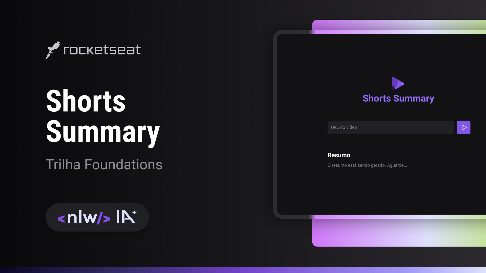

<h1 align="center"> Shorts Summary </h1>

Shorts Summary é uma aplicação web para criar resumo de vídeos shorts do Youtube utilizando Inteligência Artificial para transcrever o conteúdo do vídeo e realizar o resumo do conteúdo. Esse projeto é desenvolvido na trilha Foundations na edição NLW IA.  

  <a href="#-tecnologias">Tecnologias</a>&nbsp;&nbsp;&nbsp;|&nbsp;&nbsp;&nbsp;
  <a href="#-projeto">Projeto</a>&nbsp;&nbsp;&nbsp;|&nbsp;&nbsp;&nbsp;
  <a href="#-layout">Layout</a>&nbsp;&nbsp;&nbsp;|&nbsp;&nbsp;&nbsp;
  <a href="#memo-licença">Licença</a>

  

 

  

## 🚀 Tecnologias

Esse projeto foi desenvolvido com as seguintes tecnologias:

- HTML e CSS
- JavaScript
- Node.js e NPM
- Git e Github
- Figma
- Whisper AI
- Bard AI

## 💻 Projeto

O Shorts Summary é uma aplicação feita para resumir shorts do YouTube via texto.

## 🔖 Layout

Você pode visualizar o layout do projeto através [DESSE LINK](https://www.figma.com/community/file/1282823495335498952). É necessário ter conta no [Figma](https://figma.com) para acessá-lo.

## :memo: Licença

Esse projeto está sob a licença MIT.

---

Feito com ♥ by Rocketseat :wave: [Participe da nossa comunidade!](https://discord.gg/rocketseat)
